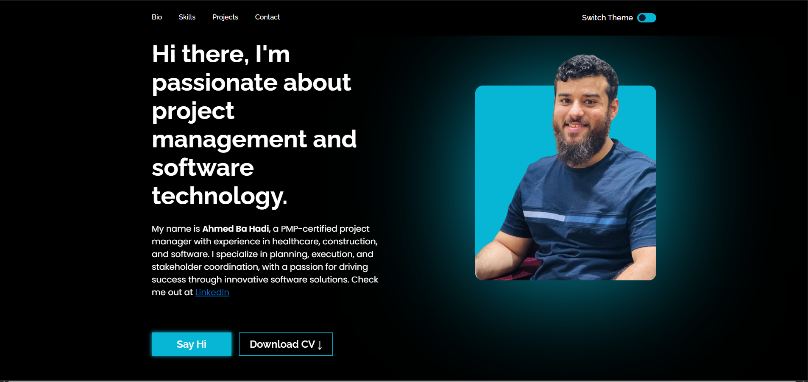

# 🌐 Ahmed's Personal Website  

  
  
  
  

Welcome to my personal portfolio website 🚀  
This project showcases my skills in **front-end web development** using modern design practices and clean code.  

---

## ✨ Features  
- ⚡ **HTML5** structure with semantic elements  
- 🎨 **CSS Grid & Flexbox** layout for modern design  
- 📱 **Responsive design** for mobile, tablet, and desktop  
- 🛠️ **SASS** for clean and maintainable styling  
- 🌍 Hosted on **GitHub Pages** (easy to access & share)  

---

## 📂 Project Structure  

ahmed-personal-website/
│── index.html
│── /css
│── /sass
│── /images
│── README.md

---

## 🚀 Live Demo  
👉 [View Website](https://abahigh2021.github.io/ahmed-personal-website/)  

---

## 🖼️ Preview  
*  ✨*  

---

## 🧑‍💻 Technologies Used  
- **HTML5**  
- **CSS3 (Grid & Flexbox)**  
- **SASS (SCSS)**  
- **Responsive Design Principles**  

---

## 📫 Contact Me  
If you’d like to connect, collaborate, or just say hi:  

- 📧 Email: *abahigh.2021@outlook.com*  
- 💼 LinkedIn: *[https://www.linkedin.com/in/ahmed-ba-hadi-l-pmp%C2%AE-b48b69237/)*  

---

⭐ Don’t forget to give this repo a **star** if you liked it!  
